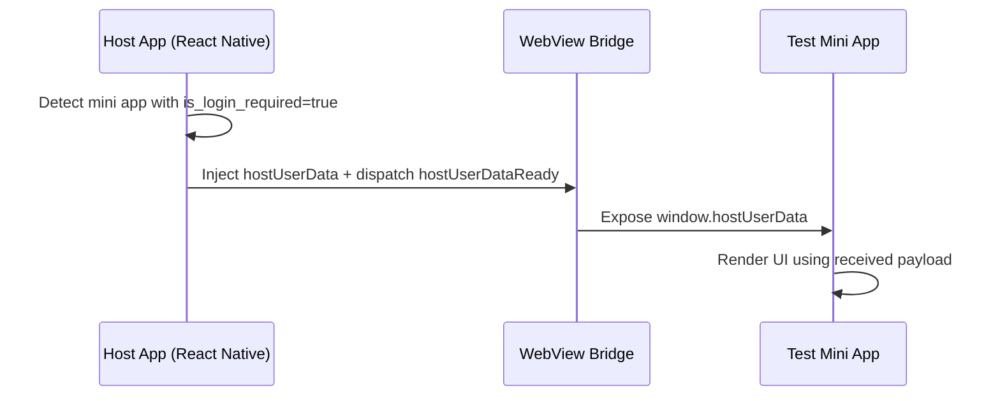

# Test Mini App

Reference implementation for consuming user identity data injected by the Ocean Host App.

## Data Flow



## Exposed Payload

`window.hostUserData` contains:

- `mini_app_id`
- `user_id`
- `username`
- `email`
- `first_name`
- `last_name`
- `profile_image_url`

## Access Patterns

### Direct lookup

```javascript
const data = window.hostUserData;
if (data) {
  console.log('Signed-in user:', data.username);
}
```

### Event driven

```javascript
window.addEventListener('hostUserDataReady', event => {
  initializeApp(event.detail);
});
```

### Defensive polling

```javascript
const pollForUserData = (attempts = 25) => {
  if (window.hostUserData) return window.hostUserData;
  if (attempts === 0) throw new Error('User data unavailable');
  return setTimeout(() => pollForUserData(attempts - 1), 200);
};
```

## Preconditions

1. API response for the mini app must include `is_login_required: true`.
2. The mini app must run inside the Host WebView; direct browser access bypasses the bridge.
3. The Host App manages authentication; mini apps never request credentials directly.

## Local Verification

1. Serve this bundle:
   ```bash
   cd mini-apps/test
   python3 -m http.server 8080
   ```
2. Set the mini app `entry_url` to one of:
   - `http://localhost:8080/index.html` (local preview)
   - `http://10.0.2.2:8080/index.html` (Android emulator)
   - `http://<HOST_IP>:8080/index.html` (physical devices)
3. Launch the Host App, open the “Test” tile, and confirm that identity data renders in the mini app UI.

The `index.html` in this directory implements all three access patterns and surfaces the payload on screen for reference.

